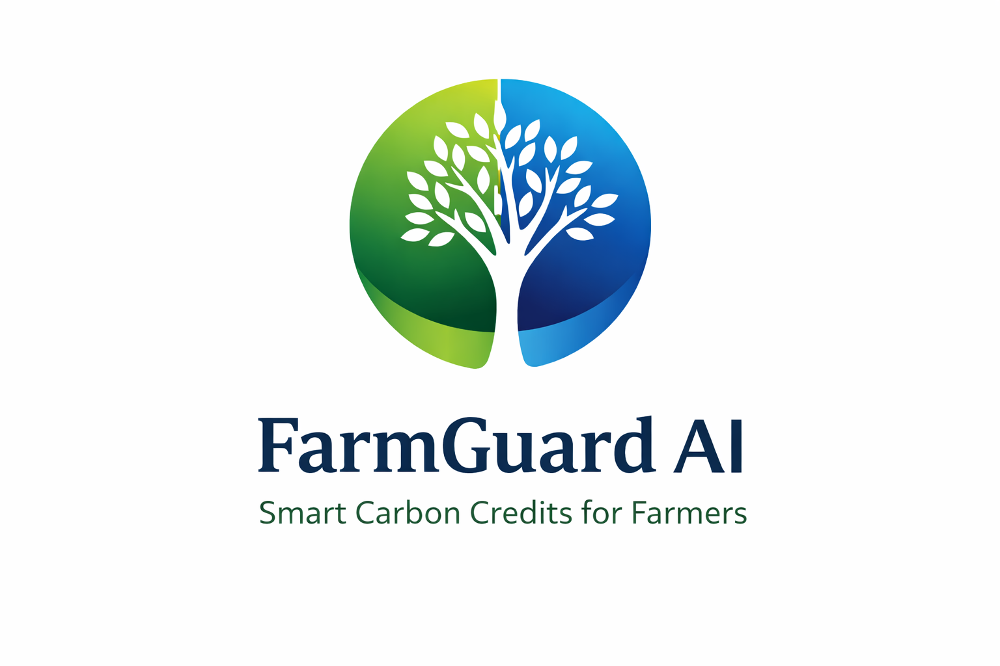

# Project: FarmGuard AI: Intelligent Agrivoltaics & Carbon Capture Using Multi-Agent
<h2>Project Name</h2>
FarmGuard AI: Intelligent Agrivoltaics & Carbon Capture
<h2>Description</h2>
<p align="center">
  
</p>

## Overview

FarmGuard AI is an **AI-powered climate technology platform** that enables **small farmers and renewable energy producers to participate in the global carbon credit economy**.

Industries across the world generate significant **greenhouse gas emissions** and rely on carbon credits to achieve **Net Zero and ESG goals**. Meanwhile, millions of farmers naturally capture carbon through trees, vegetation, and sustainable agricultural practices — but are unable to benefit due to **high verification costs, complex calculations, and lack of access to carbon markets**.

FarmGuard AI solves this problem using a **multi-agent AI system** that automates the entire carbon credit lifecycle:

-  Carbon measurement  
-  Scientific calculation  
-  AI-based validation  
-  Automated audit documentation  
-  Marketplace connection  

By combining **satellite imagery, AI models, IoT data, and Microsoft AI technologies**, the platform converts environmental impact into **verified, transparent, and tradable carbon credits**.

##  Key Capabilities

-  Detects trees and vegetation using satellite images  
-  Analyzes crop health using NDVI  
-  Calculates biomass, carbon, and CO₂  
-  Estimates avoided emissions from solar energy  
-  Validates data using AI (detects errors/fraud)  
-  Generates automatic audit reports (AI + IoT)  
-  Connects farmers with companies to sell carbon credits  

This significantly reduces verification costs and empowers farmers to generate **sustainable income while contributing to global climate action**.

## Problem Statement

Climate change is increasing due to high pollution from industries.  
Companies release large amounts of **greenhouse gases** and need to buy **carbon credits** to reduce their impact.

At the same time, farmers naturally help the environment by growing **trees, crops, and using renewable energy like solar**.

However, small farmers cannot benefit from carbon credits because:

-  They don’t know their land can earn carbon credits  
-  Carbon verification is expensive  
-  Calculations are complex and technical  
-  Audit documentation is difficult  
-  No direct access to companies or markets  

Because of this, millions of farmers are unable to earn income from their environmental contribution.

There is a need for a **simple, low-cost system** that helps farmers generate and sell **verified carbon credits easily**.


##  Solution

FarmGuard AI is a **multi-agent AI platform** with **multi-language support** that enables farmers to easily participate in the carbon credit ecosystem.

It provides a **single platform** that connects farmers, solar producers, and companies, removing the need for complex tools and manual processes.

###  Who Uses the Platform

####  Farmers
- Register land using map or documents  
- Upload farm or tree images  
- View carbon reports and earnings  

####  Solar Producers
- Upload solar generation data  
- Track avoided emissions and credits  

####  Companies
- Explore verified carbon credits  
- Purchase directly through the platform  

### 🤖 How the System Works

- Uses satellite and image data to analyze farms  
- Processes environmental data using AI models  
- Uses IoT sensor data for better validation  
- Generates ready-to-use audit reports automatically  
- Provides a simple dashboard for tracking credits and income  


## Multi-Agent AI Workflow (Semantic Kernel)
FarmGuard AI uses a **multi-agent architecture orchestrated with Microsoft Semantic Kernel** to automate carbon credit generation, validation, documentation, and marketplace connection for farmers, solar producers, and companies.

###  End-to-End Workflow

1. **Farmer Data Input**  
   Farmers upload land details, images, or sensor data.

2. **Orchestrator Agent**  
  Controls the overall workflow and decides which agent should act next using **Semantic Kernel orchestration**.

3. **Vision Agent**  
   Uses **satellite imagery and Azure AI Vision** to detect trees, vegetation, and land conditions.

4. **Carbon Analyst Agent**  
   Calculates biomass, carbon storage, CO₂ equivalent, and estimated carbon credits.
   
##### Tree-based Carbon Credit Calculation
Above-Ground Biomass (AGB):
```
AGB = 0.0673 × (ρ × DBH² × H)^0.976
```
Where:
- ρ = wood density  
- DBH = diameter at breast height  
- H = tree height  
Simplified estimation:
```
Biomass ≈ 0.25 × H²
```
Carbon stored:
```
Carbon = Biomass × 0.5
```
CO₂ equivalent:
```
CO₂ = Carbon × 3.67
```
Carbon credits:
```
Credits = CO₂ / 1000
```
##### Solar Carbon Credit Calculation
Avoided emissions:
```
Avoided CO₂ = Solar Energy Generated (kWh) × Grid Emission Factor
```
Carbon credits:
```
Credits = Avoided CO₂ / 1000
```
This allows the platform to calculate carbon credits for both **tree-based sequestration and renewable energy generation**.

5. **Validation Agent**  
   Checks for **anomalies, incorrect reporting, sudden spikes, and possible fraud** in environmental or farm data.

6. **AI + IoT Documentation**  
   Generates audit-ready reports using AI analysis and environmental sensor data.

7. **Blockchain Layer**  
   Stores verified carbon credit records securely and ensures data integrity.

8. **Market Agent**  
   Connects verified carbon credits with companies for purchase.

###  Output

- Verified Carbon Credits  
- Audit-Ready Documentation  
- Marketplace Integration  

##  System Architecture

FarmGuard AI follows a **multi-layer architecture** that integrates AI, IoT, satellite data, and blockchain to automate carbon credit generation and trading.

The platform connects **farmers, solar producers, and companies** through an intelligent and scalable system.

<p align="center">

</p>


### 🔍 Architecture Overview

The system is organized into multiple layers, each responsible for a specific function in the carbon credit lifecycle.

### 1. User Application Layer

Provides interfaces for different stakeholders:

- **Farmer Application** – Upload land details, tree images, and view carbon reports  
- **Solar Producer Application** – Upload energy data and track avoided emissions  
- **Company Portal** – Browse and purchase verified carbon credits  

### 2. AI Orchestration Layer

At the core of the system is **Semantic Kernel**, which manages the workflow between all AI agents.

- Controls execution flow  
- Coordinates agent communication  
- Ensures correct sequence of operations  

### 3. AI Processing Layer

Specialized agents perform different tasks:

- **Vision Agent** – Detects vegetation using satellite and image data  
- **Carbon Analyst Agent** – Calculates biomass, carbon, and CO₂  
- **Energy Agent** – Computes avoided emissions from solar systems  
- **Validation Agent** – Detects anomalies and ensures data accuracy  
- **Market Agent** – Matches carbon credits with buyers  

### 4. Data Analysis Layer

The system integrates multiple environmental data sources:

- **Satellite Data (Sentinel-2)** – vegetation and land monitoring  
- **Azure AI Vision** – image and vegetation analysis  
- **Geolocation (Maps API)** – land registration  
- **Solar Data** – renewable energy generation  

### 5. Documentation & Verification Layer

The platform generates **audit-ready reports automatically** using **AI and IoT data**.

Includes:

- Satellite evidence  
- Vegetation analysis  
- Carbon calculations  
- Sensor-based environmental data  

This reduces the cost and complexity of traditional audits.

### 6. Blockchain Layer

Verified carbon credits are recorded in a **secure blockchain ledger**.

Provides:

- Tamper-proof records  
- Transparent transactions  
- Trusted ownership tracking  

### 7. Data Storage Layer

Stores all system data:

- User and land information  
- Carbon calculations  
- Audit reports  
- Transaction history
  
##  Technologies Used

### Backend Technologies

- **Python (3.12.6)** – Core language for backend logic, AI agents, and carbon calculations  
- **FastAPI** – High-performance framework for building REST APIs  
- **Microsoft Semantic Kernel** – Orchestrates multi-agent workflow and communication  
- **Azure OpenAI Service** – Provides reasoning, report generation, and decision-making  
- **Azure AI Vision** – Analyzes satellite images for vegetation and land detection  
- **Sentinel-2 (Sentinel Hub)** – Provides satellite data for NDVI and vegetation monitoring  
- **IoT Integration** – Collects soil and environmental data for validation and audits  
- **Blockchain Integration** – Stores carbon credit records securely and transparently  
- **IPCC-Based Calculation Engine** – Implements standard carbon estimation formulas
  
### Frontend Technologies

- **HTML5** – Structures the web interface and dashboards  
- **CSS** – Provides responsive and modern UI design  
- **JavaScript** – Enables dynamic interaction with backend APIs  
- **Google Maps API** – Supports land registration and geolocation  
- **Solar Data (Google Cloud)** – Provides solar generation data for emission calculations  

### Development Tools

- **Git & GitHub** – Version control and project hosting  
- **Visual Studio Code** – Development environment  
- **Draw.io** – Architecture diagram design  

##  Key Features

- **Automated Carbon Credit Calculation** – Calculates carbon from trees and solar energy using AI and IPCC methods  
- **Satellite-Based Monitoring** – Uses Sentinel-2 and NDVI for vegetation and land analysis  
- **Multi-Agent AI System** – Orchestrates agents using Semantic Kernel for automation  
- **AI-Based Validation** – Detects errors, anomalies, and fraud in data  
- **Automated Audit Reports** – Generates verification-ready documentation using AI + IoT  
- **Blockchain-Based Records** – Ensures secure and tamper-proof carbon credit storage  
- **Integrated Marketplace** – Connects farmers and companies for carbon trading  
- **Easy Land Registration** – Uses map interface for simple land onboarding  
 
 ## Future Scope

- Microalgae-based carbon capture  
- NGO collaboration for farmer awareness  
- Integration with global carbon registries (Verra, Gold Standard)  
- Expansion to support millions of users worldwide  

  ## Business Impact

- Reduces carbon verification cost by up to 80%
- Enables farmers to earn additional income
- Helps companies achieve ESG and Net Zero goals
- Creates a transparent carbon marketplace  

### Visualization
#### Platform Overview

<p align="center">

</p>

#### Farmer Dashboard

<p align="center">

</p>


##  Conclusion

FarmGuard AI shows how **AI, satellite data, and multi-agent systems** can transform the carbon credit ecosystem.

By automating carbon measurement, verification, and marketplace access, it enables **farmers, solar producers, and companies** to participate in a transparent and scalable carbon economy.

The platform provides a practical solution for **climate action, sustainable agriculture, and digital carbon markets**.
## Project URL
https://github.com/Bhavana-sree/farmguard-ai-using-multiagent

## 🎥 Demo Videos

### 1️⃣ Complete Platform Demo 
https://youtu.be/dSF2wshk09Q?si=a0ie5H18kWZwEQ70

### 2️⃣ Problem & Solution Explanation
https://youtu.be/lW2vDOKTd1w

## Team
**Team Name:** Quantum Minds
Members:
- Bhavanasree B
- Sowmya N

Hackathon: **Microsoft AI Dev Days Hackathon**
