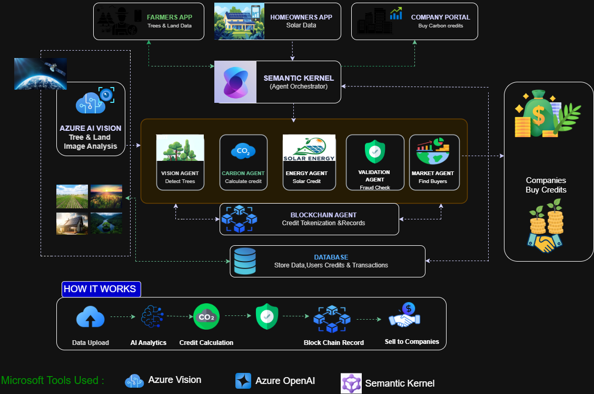
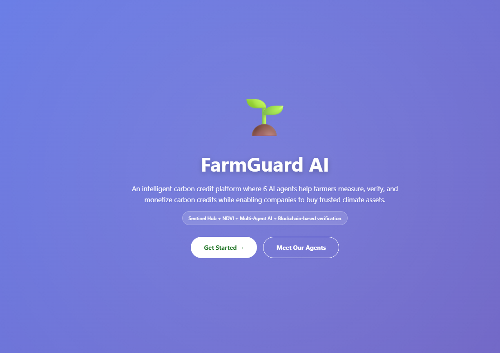
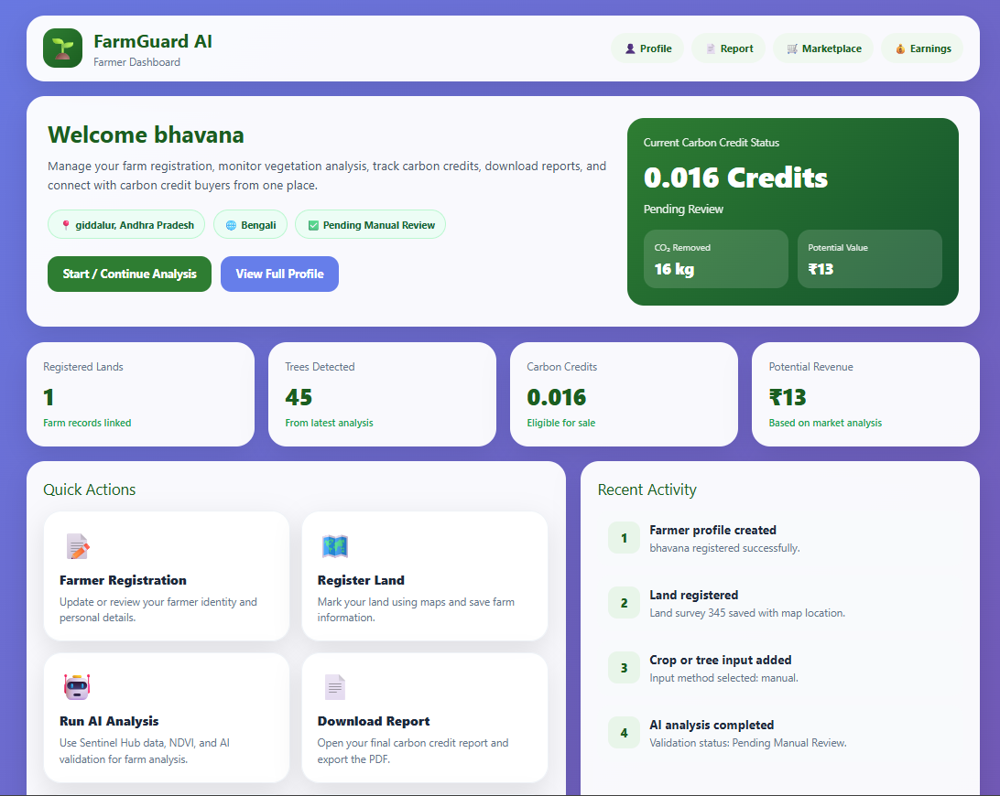

# 🌱 FarmGuard AI: Intelligent Agrivoltaics & Carbon Capture Using Multi-Agent
<h2>Project Name</h2>
FarmGuard AI: Intelligent Agrivoltaics & Carbon Capture
<h2>Description</h2>
<p align="center">
  
</p>

## Overview

FarmGuard AI is an **AI-powered climate technology platform** designed to help **small farmers and renewable energy producers participate in the global carbon credit economy**.

Across the world, companies generate significant **greenhouse gas emissions** and purchase carbon credits to offset their environmental impact. At the same time, millions of farmers grow trees, maintain vegetation, and adopt renewable energy solutions that naturally capture or prevent carbon emissions.

However, these farmers often **cannot access carbon markets** because the verification process requires **expensive audits, complex calculations, and technical expertise**.

FarmGuard AI addresses this gap by building a **multi-agent AI system** that automates the process of **carbon credit generation, verification, and marketplace connection**.

Using **satellite imagery, AI-powered analysis, and intelligent workflow orchestration with Microsoft AI technologies**, the platform helps farmers measure their environmental impact and convert it into **verified carbon credits**.

### Key Capabilities

The system automatically performs several key tasks:

- Detects **trees and vegetation** using satellite imagery and AI vision models
- Analyzes vegetation health using **NDVI and remote sensing techniques**
- Estimates **biomass and carbon sequestration**
- Calculates **avoided emissions from solar energy systems (agrivoltaics)**
- Validates environmental data using **AI-based anomaly detection**
- Generates **audit-ready documentation** for carbon credit verification
- Connects farmers directly with **companies looking to purchase carbon credits**

By automating these processes, FarmGuard AI significantly **reduces the cost and complexity of carbon verification**, enabling small and rural farmers to earn sustainable income while contributing to **global climate action**.

## Problem Statement

Climate change and global pollution are increasing rapidly due to industrial activities. Many companies produce large amounts of **greenhouse gases** and are required to purchase **carbon credits** to offset their emissions.

At the same time, millions of farmers across the world naturally capture carbon through **trees, vegetation, and sustainable agricultural practices**. Farmers who install **solar energy systems (agrivoltaics)** also help reduce carbon emissions by generating renewable energy.

However, small and rural farmers are unable to benefit from the carbon credit economy due to several barriers:

- **Lack of awareness** – Many farmers do not know that their trees and land can generate carbon credits.
- **High verification costs** – Carbon credit validation requires expensive audits and technical documentation.
- **Complex carbon calculations** – Measuring biomass, carbon sequestration, and avoided emissions requires scientific expertise.
- **Difficult documentation processes** – Generating audit-ready reports is time-consuming and costly.
- **Limited access to carbon markets** – Farmers often do not have platforms to connect with companies that buy carbon credits.

Because of these challenges, millions of small farmers cannot participate in the global carbon credit market, even though their land contributes significantly to **carbon sequestration and climate protection**.

As a result, there is a strong need for an **automated, affordable, and accessible system** that can help farmers measure their environmental impact and convert it into **verified carbon credits**.


## Solution

FarmGuard AI provides an intelligent **multi-agent AI platform with multi-language support** that connects **farmers, solar energy producers, and companies** in a unified ecosystem for generating and trading carbon credits.

The platform automates the complex process of **carbon measurement, verification, and marketplace connection** using AI, satellite monitoring, and intelligent workflow orchestration.

### Unified Climate Platform

FarmGuard AI brings three key stakeholders onto one platform:

#### Farmers

Farmers can register their **land and trees** on the platform. Using satellite imagery and AI analysis, the system:

- Detects vegetation
- Estimates biomass
- Calculates the amount of carbon dioxide absorbed by trees

This allows farmers to **generate verified carbon credits from agricultural land**.

#### Solar Energy Producers

Solar energy producers contribute to climate protection by generating **renewable energy** that replaces fossil-fuel-based electricity.

FarmGuard AI:

- Calculates **avoided carbon emissions** from solar power production
- Converts these reductions into **carbon credits**

This supports **agrivoltaic carbon accounting**.

#### Companies

Companies looking to offset their carbon footprint can:

- Browse verified carbon credits
- Purchase them directly through the platform

This creates a **transparent carbon marketplace** connecting environmental contributors with organizations committed to sustainability.

### AI-Powered Automation

FarmGuard AI simplifies carbon credit generation through intelligent automation:

- Detects trees and vegetation using satellite imagery
- Analyzes vegetation health using **NDVI remote sensing**
- Calculates biomass, carbon sequestration, and avoided emissions
- Uses AI agents for **data validation and fraud detection**
- Generates **automated audit-ready documentation**
- Connects farmers and producers with carbon credit buyers

This significantly reduces the **cost and complexity of carbon verification**, making the carbon economy accessible to small farmers.

### Microalgae Carbon Capture (Future Integration)

In future versions, FarmGuard AI will integrate **microalgae-based carbon capture systems**.

Microalgae are highly efficient at absorbing **carbon dioxide (CO₂)** and **methane**, two major greenhouse gases.

By introducing microalgae cultivation on farms, the platform can:

- Capture additional atmospheric carbon
- Reduce methane emissions
- Improve soil nutrients
- Increase crop yield
- Generate additional carbon credits for farmers


## Multi-Agent AI Workflow (Semantic Kernel)
FarmGuard AI uses a **multi-agent architecture orchestrated with Microsoft Semantic Kernel** to automate carbon credit generation, validation, documentation, and marketplace connection for farmers, solar producers, and companies.
The system combines:
- **Azure OpenAI** for reasoning, workflow decisions, reporting, and document generation
- **Azure AI Vision** for satellite image analysis, vegetation detection, and land assessment
- **Semantic Kernel** for orchestrating the interaction between all agents
In addition, the platform uses:
- **IoT data** for environmental monitoring and audit support
- **Blockchain** for secure and tamper-proof carbon credit records
This architecture allows FarmGuard AI to create a **reliable end-to-end workflow** for carbon credit generation.
### Agent Definitions
#### ORCHESTRATOR_AGENT
Controls the overall workflow and decides which agent should act next using **Semantic Kernel orchestration**.
#### VISION_AGENT
Uses **satellite imagery and Azure AI Vision** to detect:
- Trees
- Vegetation cover
- Crop health
- Land-use changes
#### CARBON_ANALYST_AGENT
Calculates **biomass, stored carbon, CO₂ equivalent, avoided emissions, and estimated carbon credits**.
##### Tree-based Carbon Credit Calculation
Above-Ground Biomass (AGB):
```
AGB = 0.0673 × (ρ × DBH² × H)^0.976
```
Where:
- ρ = wood density  
- DBH = diameter at breast height  
- H = tree height  
Simplified estimation:
```
Biomass ≈ 0.25 × H²
```
Carbon stored:
```
Carbon = Biomass × 0.5
```
CO₂ equivalent:
```
CO₂ = Carbon × 3.67
```
Carbon credits:
```
Credits = CO₂ / 1000
```
##### Solar Carbon Credit Calculation
Avoided emissions:
```
Avoided CO₂ = Solar Energy Generated (kWh) × Grid Emission Factor
```
Carbon credits:
```
Credits = Avoided CO₂ / 1000
```
This allows the platform to calculate carbon credits for both **tree-based sequestration and renewable energy generation**.
#### VALIDATION_AGENT
Checks for **anomalies, incorrect reporting, sudden spikes, and possible fraud** in environmental or farm data.
#### DOCUMENTATION_AGENT
Generates **audit-ready documentation** using **AI + IoT data**, including:
- Land details
- Vegetation evidence
- Sensor inputs
- Carbon calculation summaries
#### BLOCKCHAIN_AGENT
Records verified carbon credit data, ownership, and transaction history in a **secure and tamper-proof ledger**.
#### MARKET_AGENT
Matches verified carbon credits with **companies that want to purchase offsets**.
## System Architecture

FarmGuard AI uses a **multi-layer architecture** that connects farmers, solar producers, and companies through AI-driven automation.
The platform combines:
- Satellite imagery
- Renewable energy data
- AI agents
- IoT-supported verification
- Blockchain-based carbon credit records

<p align="center">

</p>

### Architecture Explanation
The FarmGuard AI architecture consists of several layers that work together to automate carbon credit generation and trading.
#### 1. User Applications Layer
The platform provides three main user interfaces:
- **Farmers App** – Farmers upload tree and land information.
- **Homeowners / Solar Producers App** – Solar energy producers upload solar generation data.
- **Company Portal** – Companies browse and purchase verified carbon credits.
These applications allow different stakeholders to interact with the system.
#### 2. AI Orchestration Layer
At the center of the system is **Microsoft Semantic Kernel**, which acts as the **agent orchestrator**.
Semantic Kernel manages communication between different AI agents and ensures that the workflow runs in the correct sequence.
#### 3. AI Processing Layer
The platform uses specialized AI agents for different tasks:
- **Vision Agent** – Detects trees and vegetation using satellite imagery.
- **Carbon Agent** – Calculates biomass, carbon storage, and carbon credits.
- **Energy Agent** – Calculates avoided emissions from solar energy systems.
- **Validation Agent** – Detects anomalies or incorrect environmental data.
- **Market Agent** – Connects verified credits with companies that want to buy them.
These agents work together to automate environmental analysis.
#### 4. Data Analysis Layer
FarmGuard AI integrates multiple environmental data sources:
- **Azure AI Vision** – analyzes satellite images
- **Sentinel-2 satellite data (Sentinel Hub)** – vegetation and land monitoring
- **Google Maps** – farmer land registration and geolocation
- **Solar production data** – renewable energy emission reduction analysis
These data sources provide the environmental evidence needed for carbon calculations.
#### 5. Documentation & Verification Layer
FarmGuard AI automatically generates **audit-ready carbon verification documents** using **AI and IoT data**.
The documentation includes:
- satellite image evidence
- vegetation analysis
- carbon credit calculations
- environmental monitoring data
This significantly reduces the cost of traditional carbon credit auditing.
#### 6. Blockchain Layer
The **Blockchain Agent** records verified carbon credits and ownership information in a secure ledger.
Blockchain provides:
- tamper-proof records
- transparent transactions
- trusted carbon credit ownership
#### 7. Data Storage Layer
The system stores important platform data including:
- farmer land information
- carbon credit calculations
- verification documentation
- transaction history
## Technologies Used
### Backend Technologies
The backend of FarmGuard AI powers AI orchestration, carbon credit calculations, satellite analysis, verification workflows, and marketplace connectivity.
- **Python(3.12.6)**  
  Core backend programming language used to implement AI agents, carbon credit calculations, and system logic.
- **FastAPI**  
  High-performance Python framework used to build backend APIs for communication between the frontend interface and AI services.
- **Microsoft Semantic Kernel**  
  Orchestrates the multi-agent AI workflow and manages communication between agents such as Vision Agent, Carbon Analyst Agent, Validation Agent, and Market Agent.
- **Azure OpenAI Service**  
  Provides natural language understanding, reasoning, report generation, and intelligent agent decision-making.
- **Azure AI Vision**  
  Analyzes satellite imagery to detect trees, vegetation cover, crop health, and land-use changes.
- **Sentinel-2 Satellite Data (Sentinel Hub)**  
  Provides high-resolution satellite imagery used for vegetation monitoring and NDVI analysis to estimate biomass and carbon sequestration.
- **IoT Integration**  
  Environmental sensors provide monitoring data such as soil conditions and climate parameters for audit-ready documentation.
- **Blockchain Integration**  
  Stores verified carbon credit records, ownership proof, and transaction history in a secure and tamper-proof ledger.
- **Carbon Calculation Engine (IPCC Methodology)**  
  Implements biomass estimation, carbon conversion, and avoided emission formulas for generating carbon credits.
### Frontend Technologies
The frontend interface enables farmers, solar producers, and companies to interact with the FarmGuard AI platform.
- **HTML5**  
  Structures the web interface and user dashboards.
- **CSS**  
  Provides responsive and modern UI design.
- **JavaScript**  
  Enables dynamic interaction between the user interface and backend APIs.
- **Google Maps API**  
  Allows farmers to register their land by selecting geographic locations directly on the map.
- **Solar Energy Data (Google Cloud Console)**  
  Solar generation data is retrieved and processed to calculate avoided emissions and solar-based carbon credits.
### Development Tools
- **Git & GitHub** – Version control and project repository  
- **Visual Studio Code** – Development environment  
- **Draw.io** – Architecture diagram creation
## Key Features
FarmGuard AI provides several powerful capabilities that make carbon credit generation accessible to farmers and renewable energy producers.
- **Automated Carbon Credit Calculation**  
  Uses AI models and IPCC methodologies to calculate carbon sequestration from trees and avoided emissions from solar energy.
- **Satellite-Based Environmental Monitoring**  
  Integrates Sentinel-2 satellite data via Sentinel Hub to detect vegetation, monitor land conditions, and analyze NDVI.
- **Multi-Agent AI Architecture**  
  Uses Microsoft Semantic Kernel to orchestrate specialized AI agents for vision analysis, carbon calculation, validation, documentation, and marketplace matching.
- **AI-Powered Fraud Detection**  
  Validation agents detect anomalies, suspicious data patterns, and potential reporting errors.
- **Automated Audit Documentation**  
  Combines AI analysis with IoT environmental data to generate verification-ready carbon reports.
- **Blockchain-Based Carbon Credit Records**  
  Stores carbon credit ownership and transaction history securely to ensure transparency and trust.
- **Integrated Carbon Marketplace**  
  Connects farmers and solar producers directly with companies looking to purchase verified carbon credits.
- **Land Registration via Map Interface**  
  Uses Google Maps to allow farmers to easily register their land and agricultural assets.
  ## Why FarmGuard AI is Unique

- **Multi-Agent AI Architecture**  
  Uses Microsoft Semantic Kernel to orchestrate multiple AI agents that automate carbon credit generation, validation, and marketplace operations.

- **Satellite-Based Carbon Monitoring**  
  Integrates Sentinel-2 satellite data via Sentinel Hub and NDVI analysis to detect vegetation health and estimate carbon sequestration.

- **Automated Carbon Verification**  
  Combines AI analysis with IoT environmental monitoring to generate **audit-ready documentation**, reducing verification costs for farmers.

- **Unified Carbon Marketplace**  
  Connects **farmers, solar producers, and companies** on a single platform to generate and trade carbon credits transparently.

- **Blockchain-Based Trust System**  
  Stores carbon credit ownership and transaction records in a **tamper-proof blockchain ledger**, improving transparency and trust.

- **Future Carbon Capture Innovation**  
  Plans to integrate **microalgae carbon capture systems** to absorb CO₂ and methane while generating additional carbon credits.
## Future Scope

- **Microalgae Carbon Capture**  
  Integrate microalgae cultivation systems to capture additional CO₂ and methane while generating extra carbon credits for farmers.

- **NGO Collaboration**  
  Partner with agricultural and environmental NGOs to educate farmers, promote sustainable practices, and support platform adoption in rural areas.

- **Carbon Certification & Verification**  
  Integrate with third-party auditors and global carbon registries such as **Verra** and **Gold Standard** to ensure internationally recognized carbon credit certification.

- **Global Platform Expansion**  
  Scale the platform to support **millions of farmers, renewable energy producers, and corporate sustainability programs worldwide**.

### Visualization
#### Platform Overview

<p align="center">

</p>

#### Farmer Dashboard

<p align="center">

</p>


### Conclusion
FarmGuard AI demonstrates how **AI, satellite monitoring, and intelligent agent systems** can transform the carbon credit ecosystem.
By automating carbon measurement, verification, and marketplace access, the platform makes the carbon economy accessible to **small farmers, renewable energy producers, and sustainability-focused companies**.
Through **Microsoft AI technologies, satellite data, and multi-agent orchestration**, FarmGuard AI provides a scalable solution for **climate action, sustainable agriculture, and transparent carbon credit generation**.
## Project URL
https://github.com/Bhavana-sree/farmguard-ai-using-multiagent

## 🎥 Demo Videos

### 1️⃣ Complete Platform Demo 
https://www.youtu.be/dSF2wshk09Q

### 2️⃣ Problem & Solution Explanation
https://youtu.be/lW2vDOKTd1w

## Team
**Team Name:** Quantum Minds
Members:
- Bhavanasree B
- Sowmya N

Hackathon: **Microsoft AI Dev Days Hackathon**
